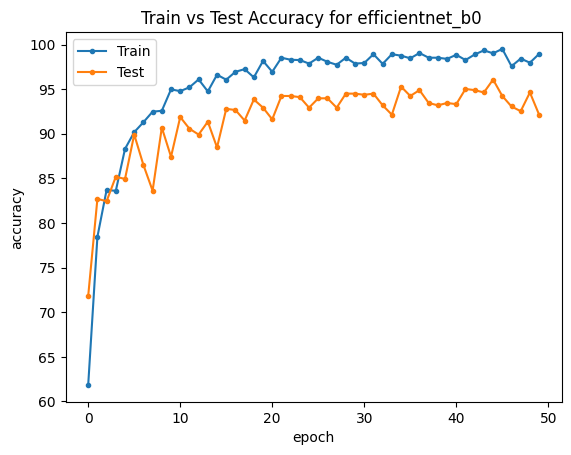
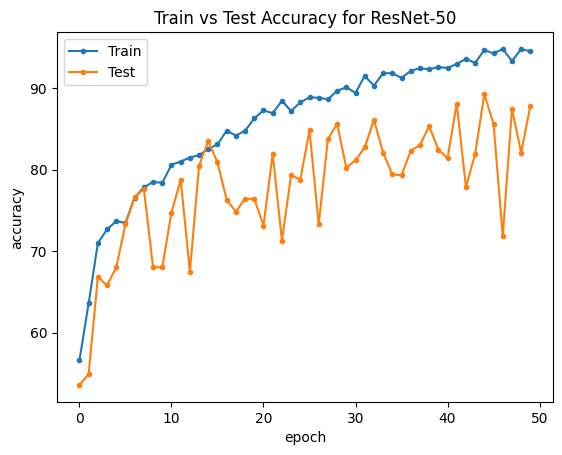

# Repository Title
COVID-multiclass-CT-scan-Classification-with-ResNet50-and-EfficientNet-B0

For more details: [https://pudasainimohan.com.np/project/covid_classification/](https://pudasainimohan.com.np/project/covid_classification/)

## Description
This repository contains Jupyter Notebooks with Python code for COVID CT scan classification using two popular deep learning models: ResNet50 and EfficientNet-B0. The notebooks are designed for easy understanding and execution, providing step-by-step guidance on training and predicting with the models. The models demonstrate outstanding performance in terms of training and testing accuracy.

## Dataset
The dataset used in the model is Kaggle public data set, which can be found on [Here](https://www.kaggle.com/datasets/plameneduardo/a-covid-multiclass-dataset-of-ct-scans/data).

## Accuracy
The following graphs represente the accuracy of the models

|

